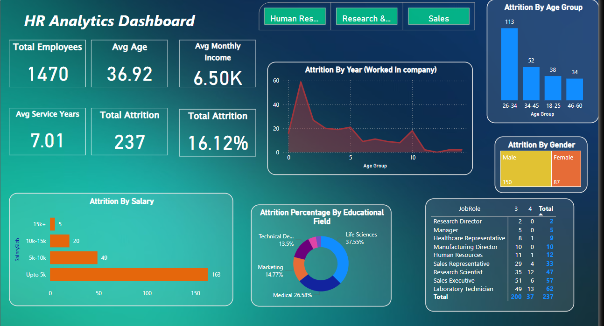
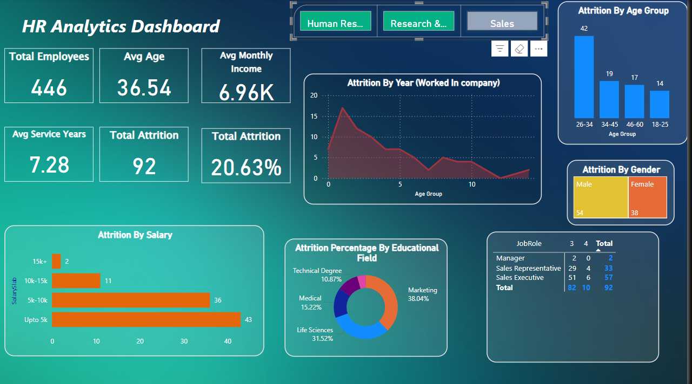

### Project Overview
This project analyzes employee attrition within a company, utilizing Power BI to visualize key metrics and trends that affect attrition rates, such as age, gender, education field, salary, and job roles.

### Tools and Features
- Power BI: Used to create an interactive dashboard for visualizing HR data.
- Dashboard Features: Metrics on employee attrition by age, gender, salary range, educational field, and job role.

### Key Insights from the Dashboard
1. Overall Attrition Rate**: The dashboard displays total attrition, average age of employees, average years of service, and other key metrics.
2. Attrition by Age Group and Gender: Shows which age groups and gender have higher attrition rates, enabling targeted retention strategies.
3. Attrition by Salary: Displays attrition across different salary ranges, helping to analyze if lower salaries are linked to higher attrition.
4. Attrition by Educational Field: Visualizes the percentage of attrition by educational background, providing insights into which fields experience higher attrition rates.

### Dashboard Preview

